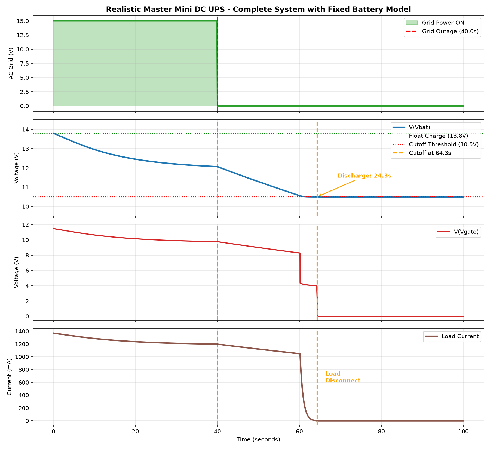

# Mini DC UPS with Op-Amp Based Analog Deep-Discharge Protection

A fully analog, solid-state 3S Li-ion DC UPS that keeps a Wi-Fi router (TP-Link Archer C54, 9 V, 0.85 A) running during mains outages. It cuts off the load before the battery pack is deeply discharged, using **no microcontroller and no firmware**.

**Course:** EEE 2187 - Electronics
**Department:** Mechatronics Engineering, Rajshahi University of Engineering & Technology (RUET), Rajshahi, Bangladesh

## Authors

| Name | Roll |
|------|------|
| Md. Farhan Shahriar Saad | 2408007 |
| Md. Raisul Islam Rifat | 2408008 |
| Abrar Shahriar Ifat | 2408009 |
| Md. Faizul Kabir Farib | 2408010 |
| Md. Mashrur Shahriyar Sinha | 2408011 |

## Supervisors

- **Prangon Das**, Assistant Professor, Dept. of Mechatronics Engineering, RUET
- **Md. Firoj Ali**, Associate Professor, Dept. of Mechatronics Engineering, RUET

## Overview

Home routers drop offline during every power cut, and Li-ion cells are permanently damaged if discharged too far. This project solves both problems with a battery backup that switches over instantly when mains power fails and disconnects the load automatically when the battery gets too low, entirely in analog hardware.

## Features

- Instant, glitch-free transfer to battery when the grid is lost
- Hard low-voltage disconnect at 9.6 V battery voltage, built from an LM324 op-amp comparator
- Stable 5.1 V Zener reference (1N4733A), independent of battery charge level
- BC547 transistor driver and IRFZ44N power MOSFET as the load switch
- LM2596 buck converter for a regulated 9 V output to the router
- Deterministic protection, immune to firmware faults

## Key Specifications

| Parameter | Value |
|-----------|-------|
| Battery pack | 3S Li-ion (12.6 V full, 9.6 V cutoff) |
| Low-voltage cutoff | 9.6 V (load disconnects at this battery voltage) |
| Regulated output | 9 V via LM2596 buck converter |
| Load | TP-Link Archer C54 router (9 V, 0.85 A) |
| Voltage reference | 5.1 V Zener (1N4733A) |

## How It Works

1. **Power stage:** An adapter float-charges the 3S Li-ion pack in parallel with the load, so the battery takes over the moment the grid drops. The LM2596 buck converter steps the battery voltage down to 9 V.
2. **Reference stage:** A 1N4733A Zener diode, biased through R1, gives a fixed 5.1 V reference.
3. **Comparator stage:** An LM324 section compares a divided sample of the battery voltage (R2, RV1, R3) against the Zener reference. RV1 is a trimpot used to calibrate the trip point.
4. **Switching stage:** When the battery voltage falls to 9.6 V, the comparator output goes LOW, the BC547 turns off, R5 pulls the MOSFET gate to 0 V, and the IRFZ44N disconnects the load's ground path.

## Components

| Designator | Part | Function |
|------------|------|----------|
| R1 | 1.2 kΩ | Zener bias |
| R2 | 8.2 kΩ | Divider (coarse) |
| RV1 | 10 kΩ trimpot | Divider (fine calibration) |
| R3 | 10 kΩ | Divider (bottom leg) |
| R4 | 4.7 kΩ | BJT base limiter |
| R5 | 10 kΩ | MOSFET gate pull-down |
| R6 | 320 Ω | LED current limiter |
| D1 | 1N4733A | 5.1 V Zener reference |
| D2 | Blue LED | Power-on indicator |
| Q1 | BC547 | NPN driver |
| Q2 | IRFZ44N | N-MOSFET load switch |
| U1:A | LM324 | Comparator (1 of 4 op-amps) |
| B1 | 3S Li-ion pack | Energy source |
| - | LM2596 | 9 V buck converter |

## Circuit Diagram

Proteus schematic of the protection circuit:

## Simulation Results

A 100 s transient simulation with a grid outage at t = 40 s. The plot shows the AC grid status, battery voltage, MOSFET gate voltage and load current.

- At the moment of outage, the load current shows no interruption (seamless transfer to battery).
- As the battery discharges, the load current falls gradually.
- When the battery reaches the 9.6 V cutoff, the gate voltage collapses to 0 V, the MOSFET turns off, and the load current drops to near zero.
- The battery voltage then holds at the cutoff level instead of falling further.

## Repository Files

| File | Description |
|------|-------------|
| [Project Report.pdf](Project%20Report.pdf) | Full project report |
| [Simulation.pdsprj.zip](Simulation.pdsprj.zip) | Proteus simulation project |
| [Circuit Diagram.bmp](Circuit%20Diagram.bmp) | Circuit schematic |
| [realistic_master_ups.png](realistic_master_ups.png) | Simulation result plot |
| [Hardware Video.mp4](Hardware%20Video.mp4) | Hardware prototype demonstration |

## How to Run the Simulation

1. Download and unzip `Simulation.pdsprj.zip`.
2. Open the `.pdsprj` file in Proteus (the schematic was made in Proteus 9 Professional).
3. Run the simulation to observe the comparator and MOSFET behavior.

## Hardware Note

During breadboard testing, the circuit switched erratically because the LM324 ground and the Zener reference were isolated from the main supply ground. Connecting all ground rails to a single common reference fixed the problem.

## Future Work

- Add hysteresis around the 9.6 V trip point to prevent chatter
- Add over-temperature protection
- Add a low-power digital state-of-charge indicator that supplements the analog cutoff
